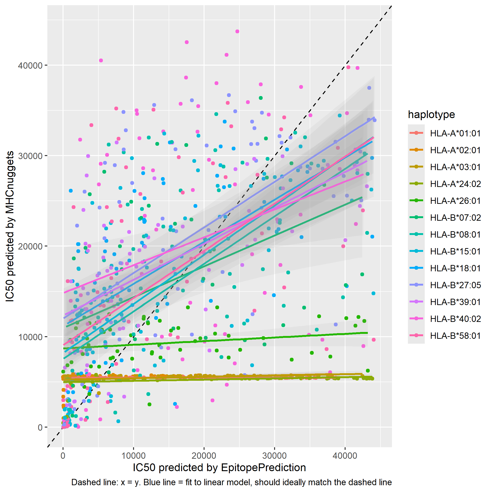
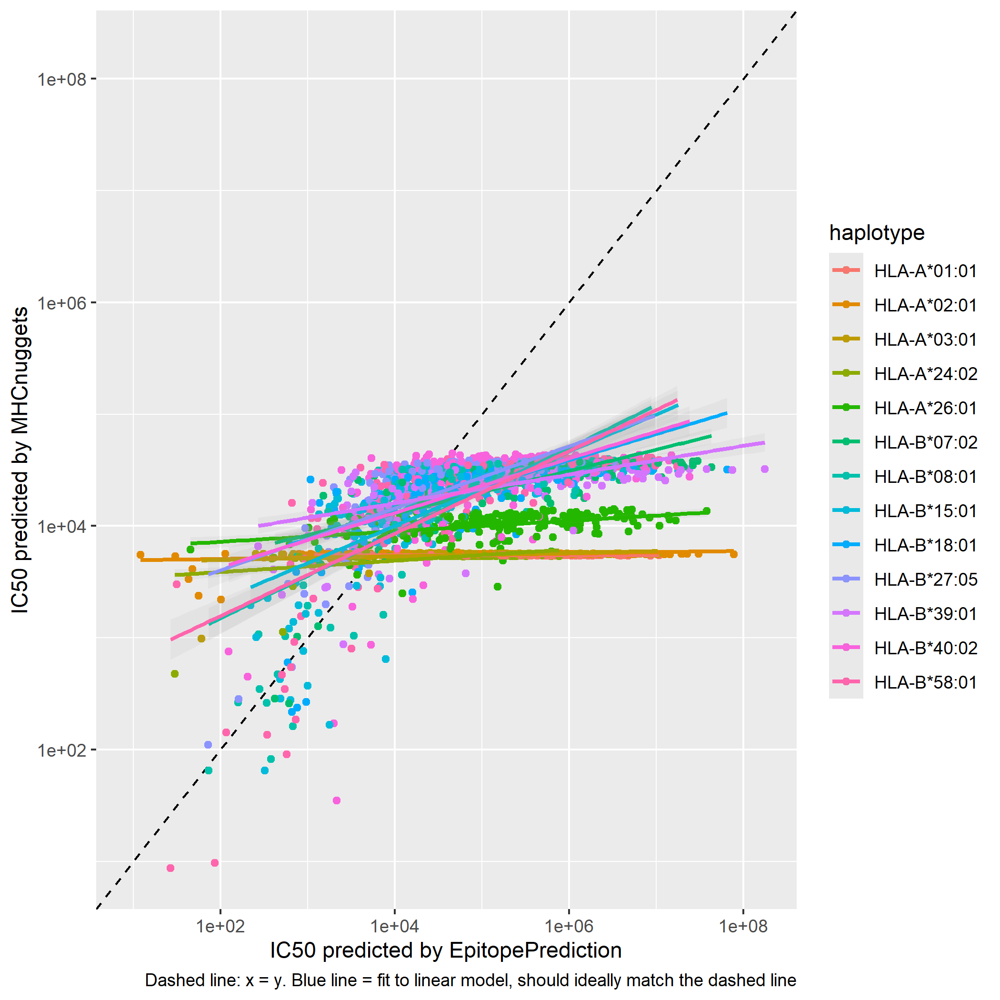
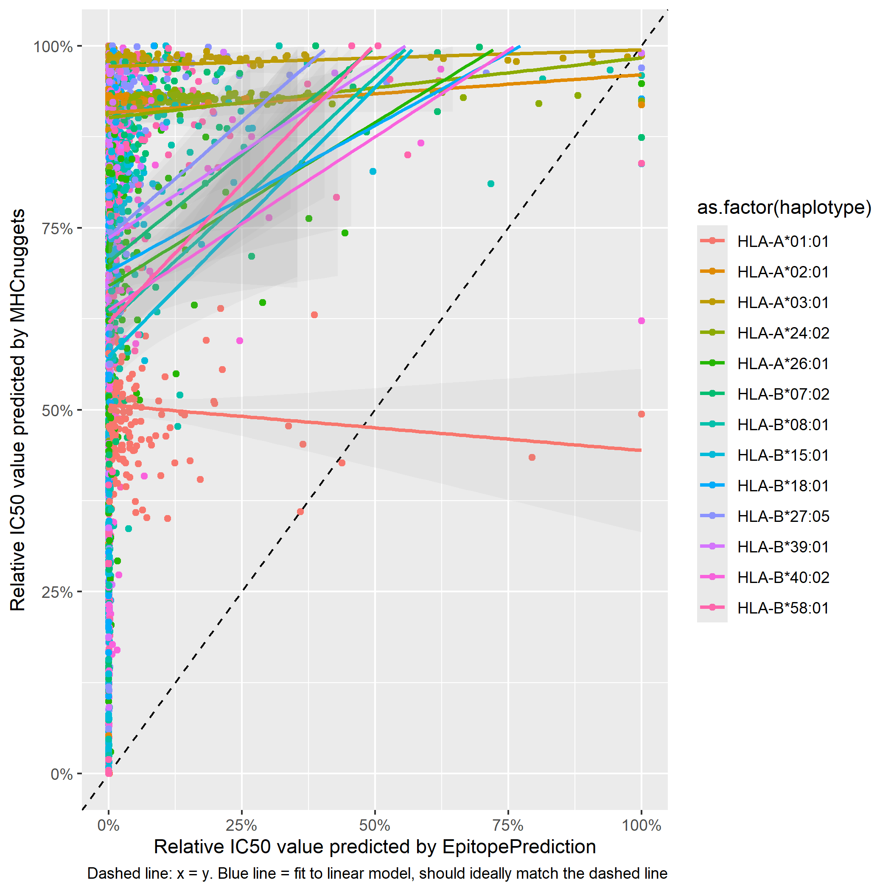
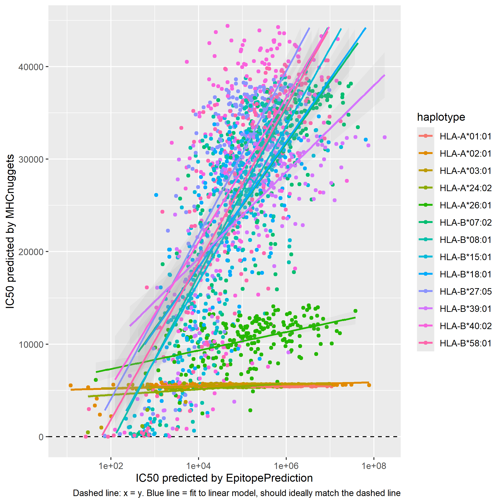
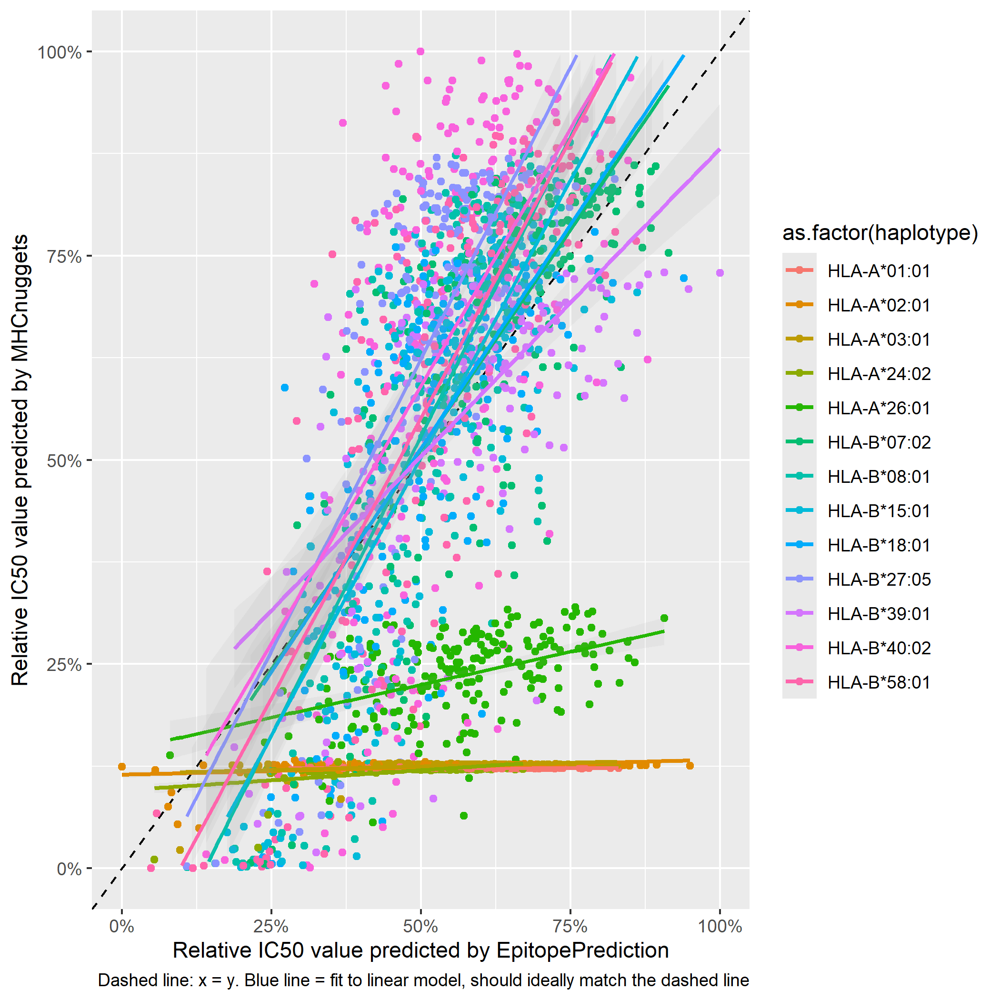
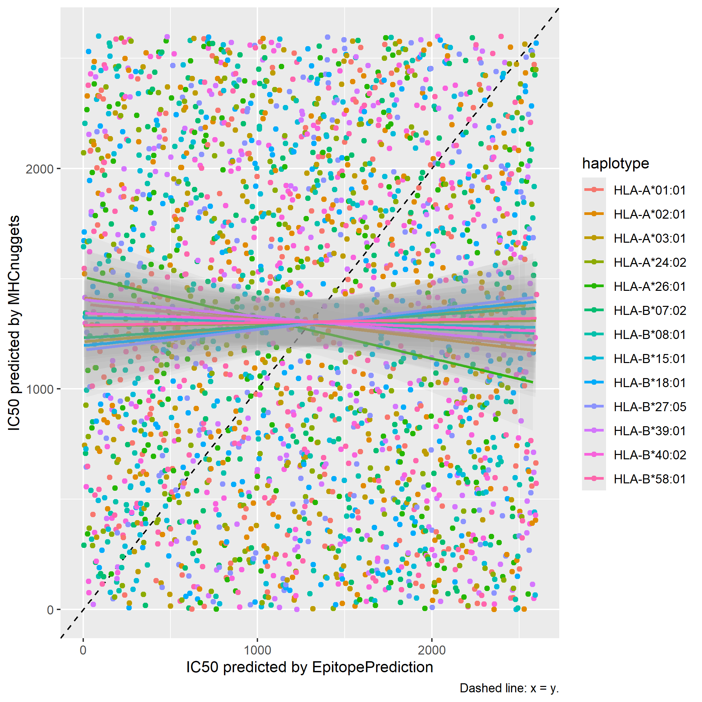
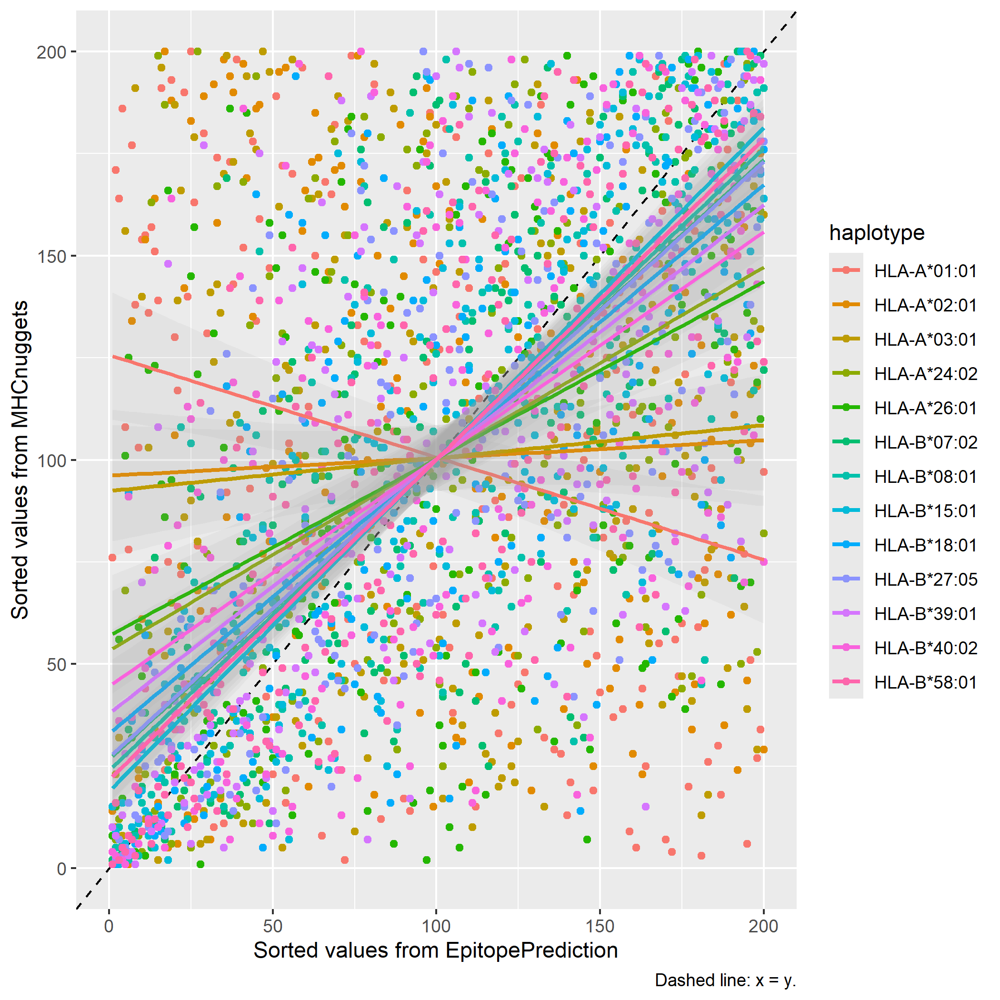

#Comparing two epitope prediction programs

* Joshua van Waardenberg
 
## Introduction

ic50 values determine how likely a strain is to be presented.

We will use the R packages MHCNuggets and EpitopePrediction to predict the ic50 values of randomly generated epitopes.
Then scatter plots are created to compare the results of the two libraries and see if they match up.

 

> figure 1

> figure 2

 

> figure 3

Ideally all the dots are on the line y = x, but the fact that they are not does not mean the results are wrong. We have to analyze these results to see if they are right or wrong.

## Hypothesis

We expect the highest prediction of MHCNuggets to also be the highest prediction of EpitopePredictions. We don't expect them to match completely because the calculations could be made using different settings meaning different values can mean the same thing.
This is determined by plotting the relative ic50 values in a graph and seeing if the trend line has a slope of 1.

## Methods

We determine if the prediction is correct by eyeballing, we expect the trend lines to have a slope of 1, which would be easy to see in the graph.

## Results

By eyeballing we see that the relative results of MHCNuggets and EpitopePrediction don't match up, it even happens that one of the higher results of MHCNuggets corresponded to the lower results of EpitopePrediction, we are able to deduct this from a negative slope, see figure 3.
After checking the data we noticed a lot of the data from EpitopePrediction falls within 1% of the highest value, while the data from MHCNuggets is spread out. That's why we decided to try plotting EpitopePrediction on a logarithmic scale while leaving MHCNuggets the same. This resulted in figure 4, and after plotting this on a relative scale we got figure 5.

> figure 4

> figure 5

We then ordered the results of MHCNuggets and EpitopePrediction to be able to see better if the highest result of MHCNuggets also gives the highest result in EpitopePrediction. Here we expect to see the dots around a clear line. However, the result we got is figure 6.

> figure 6

There is no clear line visible, and the dots are spread out over the entire graph.
Possible was that it's incorrect because the values are sorted over all the data, instead of per haplotype. However, after trying that we got a very similar result, as seen in figure 7.

> figure 7

## Conclusion

The results lead us to believe that at least one of the two libraries is wrong. 

## Discussion

MHCNuggets predicts the values using tensorflow, it might be possible that the algorithm isn't trained well enough to give precise results.

## References

https://github.com/richelbilderbeek/ep_vs_mhcn
